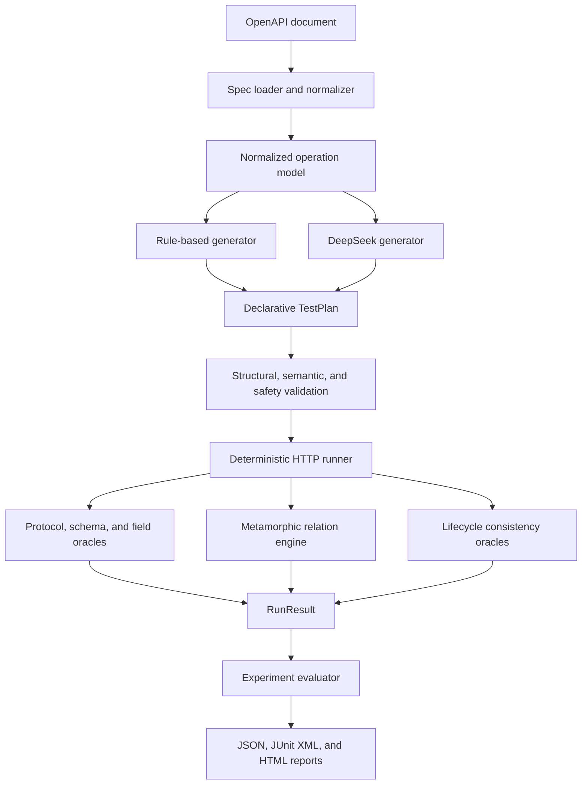
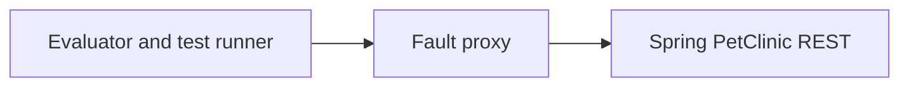
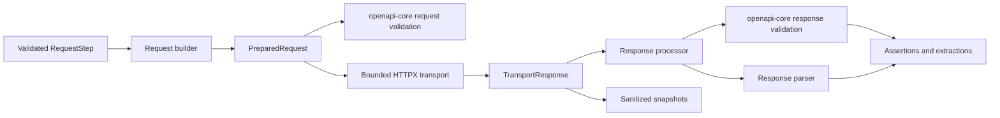

# OpenAPI AI Test Generation and Fault Evaluation Framework

## Status

| Field | Value |
| --- | --- |
| Status | Accepted for V1 implementation |
| Version | 1.0 |
| Last updated | 2026-08-18 |
| Primary benchmark | Spring PetClinic REST |
| LLM provider | DeepSeek, behind a provider interface |

## 1. Context and Motivation

OpenAPI documents describe the shape of an HTTP API, but they do not provide a
complete executable test suite. Conventional schema-driven tools can generate
basic requests and validate response structure, yet they often miss stateful and
cross-request defects. Large language models can propose richer scenarios, but
their output is probabilistic, may be invalid, and must not be trusted as the
final test oracle.

This project builds a reusable experimental framework that separates test
generation from test execution and evaluation. Rule-based and LLM-based
generators produce the same declarative `TestPlan`. A deterministic validation
and execution pipeline then evaluates those plans against clean and
fault-injected API instances.

The framework is not tied to PetClinic. PetClinic is the first reference system
under test (SUT) and benchmark used to produce reproducible V1 results.

## 2. Project Positioning

The project is an **AI test generation and fault evaluation experiment
framework**, not a hosted testing platform.

It is intended to answer three questions:

1. Can DeepSeek generate more effective executable API tests than a
   deterministic rule-based baseline?
2. How much additional fault-detection capability comes from metamorphic test
   expansion?
3. What are the cost, latency, validity, and stability trade-offs of the
   different approaches?

## 3. Goals

V1 will:

1. Parse a supported subset of OpenAPI 3.0.x and 3.1.x documents into a
   normalized internal model.
2. Define a generator-independent, declarative `TestPlan` contract.
3. Provide a deterministic rule-based generator as the baseline.
4. Integrate DeepSeek through a replaceable provider interface.
5. Validate generated plans structurally, semantically, and for execution
   safety.
6. Execute HTTP scenarios with deterministic assertions and error
   classification.
7. Support three explicit metamorphic relations and three lifecycle consistency
   checks.
8. Inject deterministic response faults through a reusable HTTP fault proxy.
9. Run a four-arm controlled experiment against PetClinic.
10. Produce machine-readable and human-readable evaluation artifacts.
11. Provide reproducible local and CI workflows with uv, Docker Compose, and
    GitHub Actions.

## 4. Non-goals

V1 will not provide:

- A hosted, multi-user Web platform.
- LLM-based pass/fail decisions.
- Execution of LLM-generated Python, JavaScript, shell commands, or templates.
- Exhaustive support for every OpenAPI feature.
- GraphQL, SOAP, WebSocket, or XML testing.
- Automated OAuth authorization flows.
- Distributed load or performance testing.
- A Model Context Protocol (MCP) adapter.
- A coverage-guided tool-calling agent loop.
- Automatic selection between multiple LLM vendors.

These items may be considered after V1 has produced a stable benchmark and
reproducible experimental result.

## 5. Supported OpenAPI Scope

V1 targets the common JSON REST subset shared by OpenAPI 3.0.x and 3.1.x. It
does not claim exhaustive OpenAPI or JSON Schema support.

### 5.1 Supported

- YAML and JSON documents.
- OpenAPI 3.0.x and 3.1.x documents.
- `GET`, `POST`, `PUT`, `PATCH`, and `DELETE` operations.
- Path, query, and header parameters with scalar string, number, boolean, or
  null values.
- `application/json` request and response bodies.
- Local `$ref` references, including adjacent Schema constraints in 3.1.
- OpenAPI 3.0 `nullable` and OpenAPI 3.1 type arrays containing `null`.
- Boolean Schemas and `allOf`, `oneOf`, and `anyOf` composition.
- Common object, array, string, and numeric constraints, including
  schema-valued `additionalProperties`, `uniqueItems`, and `multipleOf`.
- `date`, `date-time`, `uuid`, `email`, `uri`, `ipv4`, and `ipv6` formats.
- The OAS 3.1 dialect and standard JSON Schema 2020-12 dialect, at document and
  Schema-resource scope.
- API key and bearer-token values supplied at runtime.
- Generated stable operation identifiers when `operationId` is absent.

### 5.2 Explicitly unsupported in V1

- External `$ref` references.
- Custom JSON Schema dialects.
- Conditional and annotation-dependent validation such as `if` / `then` /
  `else`, `dependentSchemas`, and `unevaluatedProperties`.
- Dynamic references, tuple schemas, `contains`, `patternProperties`, and other
  JSON Schema 2020-12 features outside the documented common subset.
- String formats outside the supported format allowlist.
- `multipart/form-data` and file upload.
- XML schemas and payloads.
- Callbacks and webhooks.
- Automated OAuth token acquisition.
- Array or object path, query, and header values, including OpenAPI
  `style`/`explode` serialization for composite parameters.

Unsupported operation-level features must produce structured skip reasons.
Unsupported document-wide dialects or invalid specifications produce explicit
load errors. Unsupported behavior must not be silently ignored or counted as
covered.

## 6. Design Principles

### 6.1 Generation and judgment are separate

DeepSeek proposes test scenarios. It never decides whether a test passed.
Pass/fail decisions come only from deterministic mechanisms:

- HTTP status expectations.
- OpenAPI response validation.
- Declarative field assertions.
- State-transition assertions.
- Metamorphic relations.
- Transport and timeout errors.

### 6.2 Generated output is data, not code

Every generator returns the same schema-constrained `TestPlan`. The runner only
interprets an allowlisted set of request, extraction, and assertion operations.

### 6.3 Reproducibility is a feature

Every benchmark run records enough information to explain and reproduce the
result, including the specification hash, plan hash, prompt version, provider
configuration, Docker image information, Git revision, timings, and raw
redacted model output.

### 6.4 Portability is bounded and explicit

The framework is reusable for APIs within the supported OpenAPI subset.
PetClinic-specific operation mappings and faults remain inside the benchmark
directory and do not leak into the framework core.

## 7. High-level Architecture



The benchmark traffic path is:



With no fault enabled, the proxy operates in transparent pass-through mode.

## 8. Core Data Contracts

Pydantic models are the source of truth for runtime validation. JSON Schema is
exported from those models for fixtures, documentation, and model-output
validation.

### 8.1 `OperationModel`

The normalized representation of one OpenAPI operation contains:

- HTTP method and path.
- Stable operation identifier.
- Parameters grouped by location.
- Request body schema.
- Response schemas by status code.
- Authentication requirements.
- Tags and source location.
- Support status and structured skip reasons.

### 8.2 `TestPlan`

`TestPlan` is the only accepted output contract for generators. It contains:

- Schema version.
- Generator and source metadata.
- Target API information.
- Runtime variable declarations.
- Test scenarios.
- Ordered request steps.
- Response value extractions.
- Declarative assertions.
- Optional setup and cleanup steps.
- Optional scenario relations, classified as metamorphic relations or lifecycle
  consistency checks.

YAML is the canonical human-readable artifact format. DeepSeek is asked to
return JSON because it is easier to validate strictly; validated JSON is then
serialized to canonical YAML.

Steps reference an OpenAPI `operationId` rather than duplicating the HTTP method
and path. The validator resolves those values from the source specification.
Query parameters are represented as an ordered list so duplicate names and
parameter-order metamorphic tests remain expressible.

Runtime values may reference plan or extracted variables with the reserved
declarative form `{"$var": "variable_name"}`. A variable reference cannot have
sibling keys and never evaluates as an expression or template.

### 8.3 `Scenario` and `Step`

A scenario may contain multiple steps so that stateful flows such as
create-read-update-delete can pass values between requests. A step contains:

- An existing `operationId`.
- Parameter and body values.
- Variable references.
- Response extractions.
- Allowlisted assertions.
- Per-request timeout overrides within global limits.

Requests use one of two explicit modes. `conformant` requests must satisfy the
OpenAPI request contract. `intentionally_invalid` requests must enumerate their
expected violations, such as a missing required field or invalid type. This
distinguishes deliberate negative tests from accidentally malformed generated
requests.

Setup, primary, and cleanup steps share the same request contract. Cleanup steps
declare when they run and whether cleanup errors are best-effort, allowing the
runner to isolate state even when a primary step fails.

V1 assertions are limited to these operators:

- `status_is`
- `schema_matches`
- `equals`
- `not_equals`
- `exists`
- `contains`
- `length_is`
- `greater_than`
- `matches_pattern`

`status_is` reads the raw response status, while `schema_matches` reuses the
runtime `openapi-core` result rather than invoking a second Schema validator.
Other operators select a response body or header value with JSON Pointer syntax.
Header names are matched case-insensitively. An explicitly declared
`expected: null` is distinct from an omitted expected value, and expected values
may contain the same declarative `$var` references used by requests.

`contains` supports substring membership, array membership, object-key
membership, and partial-object matching inside arrays. This lets a stateful
scenario verify that a collection contains the resource identifier extracted
from an earlier response without copying every returned field into the plan.

Unknown operations, extractors, or assertion operators make a plan invalid.

### 8.4 `RunResult`

`RunResult` is the complete raw execution record for one `TestPlan` run against
one target and, optionally, one configured fault. It is a single object rather
than an array. A result contains scenario results; each scenario contains its
ordered step results and relation results.

The canonical artifact is JSON, but the following equivalent YAML illustrates
the V1 contract:

```yaml
schema_version: "1.0"
kind: RunResult

run_id: run-20260820-001
plan_name: lifecycle-scenarios
spec_id: demo-items-v1

started_at: "2026-08-20T10:00:00.000+08:00"
finished_at: "2026-08-20T10:00:00.184+08:00"
duration_ms: 184
outcome: passed

fault:
  configured_fault_id: null
  trigger_status: not_configured
  trigger_count: 0

scenarios:
  - scenario_id: create-read
    outcome: passed

    steps:
      - phase: main
        step_id: create
        operation_id: createItem
        outcome_policy: required
        outcome: passed
        duration_ms: 82
        retry_count: 0

        request:
          method: POST
          path: /items
          query: []
          headers:
            content-type: application/json
          body:
            media_type: application/json
            value:
              name: Created Item
              price: 10.0
              status: active
            size_bytes: 61
            truncated: false

        response:
          status_code: 201
          headers:
            content-type: application/json
          body:
            media_type: application/json
            value:
              id: item-123
              name: Created Item
              price: 10.0
              status: active
            size_bytes: 79
            truncated: false

        extractions:
          - variable: item_id
            source: response.body
            pointer: /id
            required: true
            status: extracted
            value: item-123
            redacted: false

        assertions:
          - assertion_id: assertion-1
            operator: status_is
            outcome: passed
            actual: 201
            expected: 201
            message: null
            issues: []
          - assertion_id: assertion-2
            operator: schema_matches
            outcome: passed
            actual: null
            expected: null
            message: null
            issues: []

        errors: []

      - phase: main
        step_id: read-created
        operation_id: getItem
        outcome_policy: required
        outcome: passed
        duration_ms: 67
        retry_count: 0

        request:
          method: GET
          path: /items/item-123
          query: []
          headers: {}
          body:
            media_type: null
            value: null
            size_bytes: 0
            truncated: false

        response:
          status_code: 200
          headers:
            content-type: application/json
          body:
            media_type: application/json
            value:
              id: item-123
              name: Created Item
              price: 10.0
              status: active
            size_bytes: 79
            truncated: false

        extractions: []
        assertions:
          - assertion_id: assertion-1
            operator: status_is
            outcome: passed
            actual: 200
            expected: 200
            message: null
            issues: []
          - assertion_id: assertion-2
            operator: equals
            outcome: passed
            actual: Created Item
            expected: Created Item
            message: null
            issues: []
        errors: []

    relations:
      - relation_id: created-fields-readable
        kind: lifecycle
        type: create_read_consistency
        source_step: create
        follow_up_step: read-created
        baseline_step: null
        outcome: passed

        comparisons:
          - comparison_id: comparison-1
            operator: equals
            outcome: passed
            source:
              step_id: create
              location: request.body
              pointer: /name
              value: Created Item
            follow_up:
              step_id: read-created
              location: response.body
              pointer: /name
              value: Created Item
            expected: null
            message: null

        errors: []

    errors: []

errors: []
```

The result enums are deliberately finite:

- Run, scenario, and step outcomes are `passed`, `failed`, `error`, or
  `skipped`.
- Assertion outcomes are `passed`, `failed`, `error`, or `skipped`.
- Relation outcomes additionally support `not_applicable`.
- Extraction statuses are `extracted`, `missing`, `error`, or `skipped`.
- Step phases are `setup`, `main`, or `cleanup`.
- Outcome policies are `required` or `best_effort`. `best_effort` is valid only
  for cleanup steps whose TestPlan definition sets `ignore_errors: true`.
- Fault trigger statuses are `not_configured`, `triggered`, `not_triggered`, or
  `unknown`.
- Relation comparison operators are `equals`, `set_equals`, `subset`, `prefix`,
  `one_of`, or `unchanged`.

The request snapshot contains the fully resolved request after variable
substitution. Query parameters remain an ordered list so repeated names and
parameter-order tests are representable. A response is `null` only if no HTTP
response was received. Assertions and OpenAPI validation always operate on the
original in-memory response before the stored snapshot is redacted or
truncated.

An extraction records the safe artifact value separately from the in-memory
runtime value. A sensitive value may therefore appear as `[REDACTED]` in the
result while remaining usable by later steps. A missing required extraction
fails its step; a missing optional extraction is recorded without failing the
step.

Structured errors have a stable category, location, optional JSON Pointer,
human-readable message, and an optional list of `name`/`value` evidence
records. An error is stored only at the nearest owning level and is not copied
into its parent. Parent objects propagate outcomes instead. Assertion or
relation failures produce `failed`; failures to obtain a deterministic verdict,
such as a timeout, produce `error`.

The following invariants apply:

- Finish time cannot precede start time.
- Durations, retry counts, and trigger counts cannot be negative.
- V1 performs no automatic HTTP retries, so `retry_count` is always zero.
- `not_configured` requires a null `configured_fault_id`; `triggered` and
  `not_triggered` require a non-null identifier.
- Fault detection is not a `RunResult` field. `EvaluationResult` derives it by
  comparing the clean and faulty runs after confirming that the configured
  fault triggered.
- All request, response, extraction, evidence, and diagnostic values are
  sanitized before serialization.

### 8.5 `EvaluationResult`

`EvaluationResult` contains aggregate metrics, per-fault outcomes, run metadata,
and links to the underlying artifacts.

## 9. Generation

Generators implement one logical interface:

```text
generate(specification, generation_config) -> TestPlan
```

### 9.1 Rule-based baseline

`RuleBasedGenerator` creates deterministic cases from parameter definitions,
required fields, examples, schemas, and common boundary values. Its initial
strategies include:

- Valid example requests.
- Missing required parameters.
- Invalid primitive types.
- Numeric and string boundaries.
- Unknown resource identifiers.
- Basic lifecycle scenarios when operation relationships can be resolved.

The generated plan must be stable for the same specification, configuration,
and seed.

### 9.2 DeepSeek provider

`DeepSeekGenerator` uses a provider abstraction so model-specific HTTP behavior
does not enter the domain or runner layers. It is responsible for:

- Producing a compact normalized specification context.
- Chunking operations when the configured context budget is exceeded.
- Applying a versioned prompt template.
- Requesting structured JSON output.
- Enforcing call, token, duration, and cost budgets.
- Handling timeouts, retryable transport errors, and rate limits.
- Merging and deduplicating chunk results.
- Recording token usage, latency, model identifier, and redacted raw responses.

The API endpoint, model identifier, and budgets are configuration values. They
are not hardcoded into the framework.

If the model response cannot be parsed, V1 allows at most one repair request
that only receives validation errors and asks for a corrected format. The model
does not receive runtime coverage or test-execution feedback in V1.

## 10. Validation Pipeline

OpenAPI documents are first checked by `openapi-spec-validator` and then
normalized into the framework's operation model. Standard Schema keyword
evaluation for concrete TestPlan values is delegated to
`openapi-schema-validator`; the framework-owned adapter only handles TestPlan
variables, stable violation codes, error locations, and the documented V1
support boundary.

Plans pass through three deterministic stages before execution:

1. **Structural validation** verifies the Pydantic contract and rejects unknown
   fields or operators.
2. **OpenAPI semantic validation** verifies operation identifiers, parameter
   locations, required values, supported media types, and schema compatibility.
3. **Safety validation** enforces the target allowlist, request limits, timeout
   limits, response-size limits, and rules for mutating operations.

Each error has a stable category, location, and human-readable message. Invalid
plans remain available as artifacts but are never executed.

## 11. Deterministic Runner and Oracles

The runner executes scenario steps in order using HTTPX. It supports scoped
variables, response extraction, cleanup, request deadlines, and sanitized event
logging. Runtime OpenAPI request and response validation is delegated to
`openapi-core`; it is not reimplemented in the runner.

The execution path is deliberately split into small deterministic boundaries:



The request builder resolves TestPlan variables before transport. It preserves
query-parameter order and duplicate names, applies URI encoding to path values,
and merges headers case-insensitively. It retains both the encoded request path
and the unencoded path-parameter values required by runtime contract validation.
Composite path, query, or header values produce
`unsupported_parameter_serialization` during semantic validation when their
value is statically known, and are rejected as `request_build_failed` if they
can be known only at runtime.

The transport sends a prepared request exactly once, does not follow redirects,
and does not retry. It applies the step deadline and reads the response through
a configurable byte limit before returning raw status, headers, body bytes, and
duration. Timeouts, connection failures, other HTTP transport failures, and
oversized responses remain distinct failure categories.

Thin protocol adapters expose `PreparedRequest` and `TransportResponse` through
the interfaces required by `openapi-core`. Query parameters use a multi-value
mapping so duplicate names survive validation, and request and response bodies
remain raw bytes at the library boundary. Runtime operation lookup intentionally
uses the HTTP method and OpenAPI path rather than requiring the target URL to
match the document's `servers` entries: benchmark traffic may pass through a
Docker address or fault proxy. Target authorization remains the independent
responsibility of the runner's host allowlist.

The response processor retains the raw response, all `openapi-core` contract
issues, and either parsed response data or a parsing issue. The parser
distinguishes empty, JSON, text, and binary bodies from the declared media type.
If valid JSON violates its response Schema, the parsed value remains available
to field assertions and diagnostic reporting. If JSON syntax is invalid, status
and headers remain available while body-dependent assertions and extractions
receive a parsing issue. Assertions and OpenAPI validation always run before
artifact snapshots are sanitized.

The assertion executor interprets only the finite TestPlan operator set; it does
not evaluate generated code or expressions. It resolves selectors against the
processed response, substitutes previously available `$var` values, and emits
one `AssertionResult` per declaration in plan order. A successfully evaluated
but false predicate produces `failed`. A missing runtime variable, unavailable
body, invalid dynamic pattern, or unsupported runtime type produces `error`
because no deterministic verdict could be reached. Missing selected values fail
ordinary predicates instead of allowing `not_equals` to pass accidentally.
Assertion evidence is compared in memory first and sanitized before entering
the stored result; sensitive header and JSON field names are redacted.

The runner classifies failures rather than returning a single generic error.
Initial categories include:

- `plan_invalid`
- `request_build_failed`
- `transport_error`
- `timeout`
- `unexpected_status`
- `response_schema_mismatch`
- `assertion_failed`
- `extraction_failed`
- `metamorphic_relation_violated`
- `lifecycle_consistency_violated`
- `sut_unavailable`
- `response_too_large`
- `runner_internal_error`

An LLM response is never consulted by the runner after generation.

## 12. Scenario Relations

### 12.1 Metamorphic testing

Metamorphic testing is an established testing technique rather than a
project-specific term; see the
[IEEE survey by Segura et al.](https://doi.org/10.1109/TSE.2016.2532875).
It creates a follow-up request by transforming a source request and checks a
deterministic relation between their results. Each relation declares:

- Applicability conditions.
- Source request.
- Follow-up transformation.
- Values to extract and compare.
- Volatile fields to ignore.
- The expected relation.

If applicability cannot be established, the result is `not_applicable`, not a
pass or failure.

#### MR1: Repeated-read consistency

Repeat the same safe read while the SUT state is unchanged. Stable selected
fields must remain equal. Volatile fields such as timestamps and trace IDs are
excluded explicitly.

#### MR2: Query-parameter order invariance

Send semantically identical requests with distinct query parameters in a
different order. Canonicalized responses must be equivalent. If list order is
not part of the API contract, values are compared by configured stable keys.

#### MR3: Pagination monotonicity

For the same filters and offset, increase the page limit. Under stable ordering
and unchanged state, identifiers from the smaller result must be a subset or
prefix of the larger result.

### 12.2 Lifecycle consistency checks

The following checks validate stateful API workflows. They are scenario
relations, but they are not classified as metamorphic testing because they do
not derive a follow-up test through the same input-transformation principle.

#### Create-read consistency

Create a resource, extract its identifier, and read it back. Fields accepted in
the create request must agree with the corresponding retrievable fields, subject
to documented server normalization.

#### Update-read consistency

Update selected fields and read the resource again. Updated fields must reflect
the new values, while configured untouched stable fields remain unchanged.

#### Delete-read consistency

Delete a resource and attempt to retrieve it again. The resource must be absent
or the API must return one of the documented not-found outcomes.

Checks that require unsupported endpoint behavior, such as pagination on an API
without pagination, are excluded from that benchmark's denominator.

## 13. Fault Injection

The fault proxy is a lightweight FastAPI service placed between the runner and
the SUT. It:

- Transparently forwards requests and responses.
- Matches requests using declarative fault configuration.
- Applies one deterministic response mutation at a time.
- Records whether the mutation actually triggered.
- Emits a fault identifier in sanitized diagnostic metadata.
- Provides a pass-through mode for the clean baseline.

Framework code knows only the generic fault contract. PetClinic fault instances
are stored under the benchmark directory.

V1 defines 12 PetClinic fault instances:

- Six feedback faults used during implementation and prompt tuning.
- Six holdout faults excluded from prompt and rule tuning.

The set covers categories such as:

- Incorrect status codes.
- Missing required response fields.
- Incorrect response field types.
- Incorrect resource identifiers.
- Missing or duplicated list items.
- Stale values after an update.
- A deleted resource remaining visible.
- Inconsistent pagination metadata.
- Inconsistent linked-resource data.

Every fault must have a reference test proving that it triggers and is
observable. Equivalent or unreachable faults are excluded before the benchmark
is frozen.

## 14. Experiment Design

### 14.1 Arms

| Arm | Base test generation | Metamorphic expansion |
| --- | --- | --- |
| A | Rule-based generator | Disabled |
| B | The exact base plan produced for A | Enabled |
| C | DeepSeek generator | Disabled |
| D | The exact base plan produced for C | Enabled |

A/B and C/D form paired comparisons. B and D only add deterministic
metamorphic follow-up tests to their corresponding base plans, isolating the
value of metamorphic expansion from both generator choice and LLM sampling
variance. Stateful lifecycle scenarios are normal base-plan capabilities and
may appear in every arm; they are not added only to the metamorphic arms.

### 14.2 Protocol

The benchmark uses three paired repetitions. For each repetition:

1. Record the complete configuration and environment manifest.
2. Produce the rule-based plan and one independent DeepSeek plan.
3. Derive B deterministically from A and D deterministically from C.
4. Reset PetClinic to a known state.
5. Execute each plan through the proxy in pass-through mode.
6. Exclude or diagnose tests that fail on the clean baseline.
7. Reset the SUT before every injected fault.
8. Enable exactly one fault.
9. Execute the eligible tests and confirm that the fault triggered.
10. Store raw results before calculating aggregates.

Feedback and holdout results are reported separately. Prompt and generator
changes stop after the holdout set is frozen.

### 14.3 Fault-detection rule

A fault is counted as detected only when all conditions hold:

```text
the test passes on the clean SUT
and the proxy confirms that the fault triggered
and a deterministic oracle fails on the faulty SUT
```

This prevents invalid tests, unavailable services, and untriggered mutations
from being counted as successful detections.

## 15. Metrics

### 15.1 Primary metrics

- **Plan validity rate:** structurally and semantically valid generated test
  cases divided by generated test cases.
- **Executable test rate:** tests that reach a deterministic verdict divided by
  validated tests.
- **Operation coverage:** eligible OpenAPI operations exercised by at least one
  valid test divided by all eligible operations.
- **Fault detection rate:** detected, non-equivalent faults divided by triggered,
  eligible faults.
- **Clean-baseline false-positive rate:** clean executions that fail a test
  oracle divided by clean eligible executions.

### 15.2 Efficiency and stability metrics

- Faults detected per 100 HTTP requests.
- Generation and execution duration.
- DeepSeek input and output tokens.
- Estimated generation cost.
- Number of scenarios and HTTP requests.
- Mean and standard deviation over repetitions.
- Outcome agreement across repetitions.

Raw and normalized fault-detection results are both reported so larger test
suites do not receive an unexplained advantage.

## 16. Artifacts and Reproducibility

Each run creates an immutable artifact directory:

```text
artifacts/
└── <run-id>/
    ├── manifest.json
    ├── config.yaml
    ├── inputs/
    │   └── openapi.yaml
    ├── generation/
    │   ├── raw-response.json
    │   └── test-plan.yaml
    ├── execution/
    │   └── results.jsonl
    ├── evaluation/
    │   └── summary.json
    └── reports/
        ├── junit.xml
        └── report.html
```

The manifest records:

- Git revision.
- Run seed.
- Experiment arm and repetition.
- OpenAPI and TestPlan hashes.
- Prompt version and hash.
- Provider and model identifier.
- Generation parameters and budgets.
- Docker image identifiers.
- Tool and Python versions.
- Start and finish timestamps.

Secrets and unredacted authorization values are never stored in artifacts.

## 17. Command-line Interface

The installed CLI name is `oate`. The planned V1 surface is:

```text
oate spec validate --spec <openapi-file>
oate generate --spec <openapi-file> --generator rule|deepseek --out <plan>
oate plan validate --spec <openapi-file> --plan <plan>
oate run --spec <openapi-file> --plan <plan> --base-url <url>
oate benchmark --config <benchmark-config>
oate report --run <artifact-directory>
```

Command output is concise for humans and supports JSON mode for CI.

## 18. Repository Layout

```text
src/openapi_ai_test_evaluator/
├── cli/
├── domain/
├── spec/
├── generators/
├── validation/
├── execution/
├── metamorphic/
├── evaluation/
└── reporting/

services/
└── fault_proxy/

benchmarks/
└── petclinic/
    ├── config/
    ├── faults/
    └── reference_tests/

tests/
├── unit/
├── integration/
└── e2e/

docs/
examples/
artifacts/
```

Benchmark-specific code and data must depend on the framework, never the other
way around.

## 19. Technology Choices

- Python 3.12 managed with uv.
- Pydantic for contracts and validation.
- `openapi-spec-validator` for OpenAPI document validation.
- `openapi-schema-validator` for static Schema value validation.
- `openapi-core` for runtime HTTP request and response validation.
- HTTPX for HTTP execution and provider calls.
- PyYAML for human-readable plan and configuration artifacts.
- Typer and Rich for the CLI.
- FastAPI for the standalone fault proxy only.
- pytest for unit, integration, and end-to-end tests.
- Ruff for linting and formatting.
- Docker and Docker Compose for benchmark isolation.
- GitHub Actions for continuous integration.

HTML reports use lightweight templates. V1 does not add a frontend application
or database.

## 20. Testing Strategy

### 20.1 Unit tests

Unit tests cover data contracts, OpenAPI normalization, generation rules,
validation, assertions, error classification, fault operators, and metamorphic
relations without external network access.

### 20.2 Integration tests

A small local fixture API verifies the complete plan-validation and execution
pipeline independently of PetClinic and DeepSeek. Provider behavior is tested
with recorded or mocked responses.

### 20.3 End-to-end tests

Docker Compose starts PetClinic and the fault proxy for lifecycle, fault
activation, reset, and report-generation tests.

### 20.4 CI policy

Pull-request CI does not call the live DeepSeek API. It runs linting, unit tests,
fixture integration tests, schema checks, and Docker build checks. A real-model
benchmark is manual and uses repository secrets; it is never required for an
untrusted pull request.

## 21. Security Constraints

- API keys are read from environment variables only.
- `.env` files, tokens, and unredacted authorization headers are excluded from
  Git and artifacts.
- The runner enforces an explicit target-host allowlist.
- Requests have global and per-request deadlines.
- Response bodies have configurable size limits.
- Every run has maximum scenario and request counts.
- Mutating operations require an explicit isolated-test-environment setting.
- Generated content is never evaluated or imported as executable code.
- PetClinic state is recreated between fault scenarios.

## 22. Risks and Mitigations

| Risk | Mitigation |
| --- | --- |
| Incomplete or ambiguous OpenAPI documents | Report structured unsupported and unresolved-operation reasons. |
| Invalid LLM output | Strict schema validation and at most one format-only repair request. |
| LLM nondeterminism | Paired C/D design, three repetitions, and complete raw artifacts. |
| False positives from volatile response fields | Explicit comparison projections and clean-baseline eligibility. |
| State contamination between faults | Recreate or reset the SUT before each fault. |
| Equivalent or unreachable faults | Require reference tests before freezing the benchmark. |
| Larger suites receiving an unfair advantage | Report detections per 100 requests alongside raw detection rate. |
| Excess DeepSeek cost | Enforce call, token, time, and cost budgets; support recorded responses during development. |
| Framework becoming PetClinic-specific | Keep all operation mappings and fault instances in the benchmark package. |

## 23. V1 Acceptance Criteria

V1 is complete when:

1. At least two different OpenAPI fixture applications run through the core
   pipeline, demonstrating that the framework is not PetClinic-specific.
2. Rule-based and DeepSeek generators produce the same `TestPlan` contract.
3. Invalid or unsafe plans are deterministically rejected before execution.
4. The runner never executes generated code.
5. All three metamorphic relations and all three lifecycle consistency checks
   have unit tests and executable examples.
6. All 12 PetClinic faults can be enabled independently and have reference
   tests.
7. Three complete four-arm repetitions have been recorded.
8. JSON, JUnit XML, and HTML reports are generated from the same raw results.
9. `uv run pytest` passes in a clean checkout.
10. Docker Compose reproduces the PetClinic benchmark environment.
11. CI succeeds without a DeepSeek API key.
12. A new user can reproduce the rule-based baseline from the README in ten
    minutes or less.

## 24. Future Work

Candidate V1.1 capabilities include:

- Broader OpenAPI 3.1 and JSON Schema 2020-12 keyword coverage.
- MCP adapter and evaluation skill.
- A coverage-guided bounded tool-calling agent.
- Multiple LLM providers and model regression comparisons.
- Prompt regression testing.
- Additional fault operators and benchmark applications.
- OAuth and multipart support.

A future agent loop must have explicit maximum iterations, API calls, tokens,
cost, and wall-clock duration. It must also define measurable stopping conditions
and persist the complete tool-call trace.
