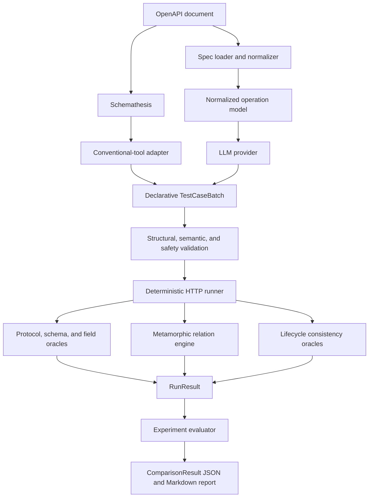
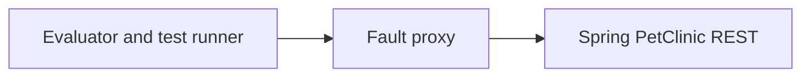
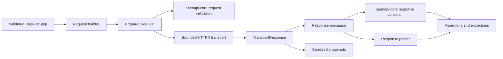

# OpenAPI AI Test Generation and Fault Evaluation Framework

## Status

| Field | Value |
| --- | --- |
| Status | V1 implementation in progress |
| Version | 1.1 |
| Last updated | 2026-08-27 |
| Primary benchmark | Spring PetClinic REST |
| LLM providers | Extensible provider interface; DeepSeek implemented first |
| Conventional baseline | Schemathesis stateless adapter implemented |

## 1. Context and Motivation

OpenAPI documents describe the shape of an HTTP API, but they do not provide a
complete executable test suite. Conventional schema-driven tools can generate
basic requests and validate response structure, yet they often miss stateful and
cross-request defects. Large language models can propose richer scenarios, but
their output is probabilistic, may be invalid, and must not be trusted as the
final test oracle.

This project builds a reusable experimental framework that separates test
generation from test execution and evaluation. LLM providers generate a strict,
runner-ready `TestCaseBatch`; conventional tools enter through explicit
adapters. Adapted cases use the same deterministic validation and HTTP runner
against clean and fault-injected API instances. Tool-native capabilities that
cannot be represented without losing meaning are kept as secondary external
baselines and mapped into the same evaluation metrics instead of being falsely
presented as identical cases.

The framework is not tied to PetClinic. PetClinic is the first reference system
under test (SUT) and benchmark used to produce reproducible V1 results.

## 2. Project Positioning

The project is an **AI test generation and fault evaluation experiment
framework**, not a hosted testing platform.

It is intended to answer three questions:

1. Can an LLM generate more effective executable API tests than a mature
   schema-driven baseline under the same API, fault set, and execution budget?
2. How much additional fault-detection capability comes from metamorphic test
   expansion?
3. What are the cost, latency, validity, and stability trade-offs of the
   different approaches?

## 3. Goals

V1 will:

1. Parse a supported subset of OpenAPI 3.0.x and 3.1.x documents into a
   normalized internal model.
2. Define a generator-independent, declarative `TestCaseBatch` contract.
3. Integrate Schemathesis as the first mature schema-driven baseline through an
   adapter rather than implementing a competing baseline from scratch.
4. Integrate LLM vendors through a replaceable provider interface, with
   DeepSeek as the first implementation.
5. Validate generated case batches structurally, semantically, and for execution
   safety.
6. Execute HTTP test cases with deterministic assertions and error
   classification.
7. Support three explicit metamorphic relations and three lifecycle consistency
   checks.
8. Inject deterministic response faults through a reusable HTTP fault proxy.
9. Run a four-arm controlled experiment against PetClinic.
10. Produce machine-readable and human-readable evaluation artifacts.
11. Provide reproducible local and CI workflows with uv, Docker Compose, and
    GitHub Actions.

## 4. Non-goals

V1 will not provide:

- A hosted, multi-user Web platform.
- LLM-based pass/fail decisions.
- Execution of LLM-generated Python, JavaScript, shell commands, or templates.
- Exhaustive support for every OpenAPI feature.
- GraphQL, SOAP, WebSocket, or XML testing.
- Automated OAuth authorization flows.
- Distributed load or performance testing.
- A Model Context Protocol (MCP) adapter.
- A coverage-guided tool-calling agent loop.
- Automatic model routing or selection between LLM vendors.

These items may be considered after V1 has produced a stable benchmark and
reproducible experimental result.

## 5. Supported OpenAPI Scope

V1 targets the common JSON REST subset shared by OpenAPI 3.0.x and 3.1.x. It
does not claim exhaustive OpenAPI or JSON Schema support.

### 5.1 Supported

- YAML and JSON documents.
- OpenAPI 3.0.x and 3.1.x documents.
- `GET`, `POST`, `PUT`, `PATCH`, and `DELETE` operations.
- Path, query, and header parameters with scalar string, number, boolean, or
  null values.
- `application/json` request and response bodies.
- Local `$ref` references, including adjacent Schema constraints in 3.1.
- OpenAPI 3.0 `nullable` and OpenAPI 3.1 type arrays containing `null`.
- Boolean Schemas and `allOf`, `oneOf`, and `anyOf` composition.
- Common object, array, string, and numeric constraints, including
  schema-valued `additionalProperties`, `uniqueItems`, and `multipleOf`.
- `date`, `date-time`, `uuid`, `email`, `uri`, `ipv4`, and `ipv6` formats.
- The OAS 3.1 dialect and standard JSON Schema 2020-12 dialect, at document and
  Schema-resource scope.
- API key and bearer-token values supplied at runtime.
- Generated stable operation identifiers when `operationId` is absent.

### 5.2 Explicitly unsupported in V1

- External `$ref` references.
- Custom JSON Schema dialects.
- Conditional and annotation-dependent validation such as `if` / `then` /
  `else`, `dependentSchemas`, and `unevaluatedProperties`.
- Dynamic references, tuple schemas, `contains`, `patternProperties`, and other
  JSON Schema 2020-12 features outside the documented common subset.
- String formats outside the supported format allowlist.
- `multipart/form-data` and file upload.
- XML schemas and payloads.
- Callbacks and webhooks.
- Automated OAuth token acquisition.
- Array or object path, query, and header values, including OpenAPI
  `style`/`explode` serialization for composite parameters.

Unsupported operation-level features must produce structured skip reasons.
Unsupported document-wide dialects or invalid specifications produce explicit
load errors. Unsupported behavior must not be silently ignored or counted as
covered.

## 6. Design Principles

### 6.1 Generation and judgment are separate

Generators propose test cases. An LLM never decides whether a test passed.
Pass/fail decisions come only from deterministic mechanisms:

- HTTP status expectations.
- OpenAPI response validation.
- Declarative field assertions.
- State-transition assertions.
- Metamorphic relations.
- Transport and timeout errors.

### 6.2 Generated output is data, not code

LLM providers and compatible conventional-tool adapters return the same
schema-constrained `TestCaseBatch`. The runner only interprets an allowlisted
set of request, extraction, assertion, and relation operations. Generated
Python, JavaScript, shell commands, and templates are never executed.

### 6.3 Reproducibility is a feature

Every benchmark run records enough information to explain and reproduce the
result, including the specification hash, case-batch hash, prompt version,
provider or tool configuration, Docker image information, Git revision,
timings, and preserved raw provider output. Provider credentials are never
supplied to generator content and therefore never belong in that artifact.

### 6.4 Portability is bounded and explicit

The framework is reusable for APIs within the supported OpenAPI subset.
PetClinic-specific operation mappings and faults remain inside the benchmark
directory and do not leak into the framework core.

## 7. High-level Architecture



The benchmark traffic path is:



With no fault enabled, the proxy operates in transparent pass-through mode.

### 7.1 Current implementation checkpoint

Implemented as of 2026-08-27:

- OpenAPI 3.0/3.1 common-scope loading, normalization, and static validation.
- Strict `TestCaseBatch`, `GenerationConfig`, `GenerationRecord`, and
  `RunResult` contracts.
- Versioned LLM prompts, the DeepSeek HTTP adapter, raw-output preservation, and
  the `oate cases generate` command.
- Schemathesis examples, coverage, and per-operation fuzzing generation with
  explicit adaptation metrics and `oate cases generate-baseline`.
- Structural and OpenAPI semantic validation for generated cases.
- Deterministic HTTP execution with variables, assertions, extractions,
  setup/main/cleanup, and all six declared relation types.
- A deterministic FastAPI fixture with real local-HTTP integration coverage.
- Generic response-fault contracts and mutation operators, plus a standalone
  FastAPI proxy with pass-through mode, single-fault activation, bounded
  upstream responses, and observable trigger counts.
- A four-fault Demo Items infrastructure catalog with reference tests for
  triggerability and observability.
- Clean-versus-fault execution orchestration for one frozen `TestCaseBatch`,
  including deterministic reset order, trigger observation, and final proxy
  cleanup, covered by a real-HTTP end-to-end test.
- Strict single-suite evaluation with admission, execution, coverage,
  efficiency, and five-state fault outcomes correlated to response evidence.
- Paired multi-suite/repetition aggregation with raw and normalized metrics,
  missing-value accounting, per-fault stability, and deterministic JSON and
  Markdown report output through `oate report compare`.
- Legacy hand-authored `TestPlan` validation and execution compatibility.

Still required for the V1 experiment:

- PetClinic benchmark packaging and deterministic reset workflow.
- PetClinic fault catalog and reference trigger/observability tests.
- Top-level benchmark orchestration, Docker Compose, and CI workflows.

## 8. Core Data Contracts

Pydantic models are the source of truth for runtime validation. JSON Schema is
exported from those models for fixtures, documentation, and model-output
validation.

### 8.1 `OperationModel`

The normalized representation of one OpenAPI operation contains:

- HTTP method and path.
- Stable operation identifier.
- Parameters grouped by location.
- Request body schema.
- Response schemas by status code.
- Authentication requirements.
- Tags and source location.
- Support status and structured skip reasons.

### 8.2 `TestCaseBatch`

`TestCaseBatch` is the canonical runner-ready output contract for generation
and compatible adapters. It contains:

- Schema version.
- One or more independently executable test cases.
- Ordered request steps.
- Response value extractions.
- Declarative assertions.
- Optional setup and cleanup steps.
- Optional test-case relations, classified as metamorphic relations or lifecycle
  consistency checks.

JSON is the canonical generated artifact format and YAML is supported for
human-authored fixtures. LLM providers are asked to return JSON because it is
easier to validate strictly. Generation metadata and raw provider output are
stored separately so an invalid model response remains inspectable without
being confused with executable cases.

Steps reference an OpenAPI `operationId` rather than duplicating the HTTP method
and path. The validator resolves those values from the source specification.
Query parameters are represented as an ordered list so duplicate names and
parameter-order metamorphic tests remain expressible.

Runtime values may reference extracted or configured variables with the reserved
declarative form `{"$var": "variable_name"}`. A variable reference cannot have
sibling keys and never evaluates as an expression or template.

The older `TestPlan` contract remains available as a hand-authored compatibility
entry point while existing examples and callers migrate. New generators do not
emit `TestPlan`, and experiment artifacts use `TestCaseBatch`.

### 8.3 `TestCase` and `RequestStep`

A test case may contain multiple steps so that stateful flows such as
create-read-update-delete can pass values between requests. A step contains:

- An existing `operationId`.
- Parameter and body values.
- Variable references.
- Response extractions.
- Allowlisted assertions.
- Per-request timeout overrides within global limits.

Requests use one of two explicit modes. `conformant` requests must satisfy the
OpenAPI request contract. `intentionally_invalid` requests must enumerate their
expected violations, such as a missing required field or invalid type. This
distinguishes deliberate negative tests from accidentally malformed generated
requests.

Setup, primary, and cleanup steps share the same request contract. Cleanup steps
declare when they run and whether cleanup errors are best-effort, allowing the
runner to isolate state even when a primary step fails.

V1 assertions are limited to these operators:

- `status_is`
- `schema_matches`
- `equals`
- `not_equals`
- `exists`
- `contains`
- `length_is`
- `greater_than`
- `matches_pattern`

`status_is` reads the raw response status, while `schema_matches` reuses the
runtime `openapi-core` result rather than invoking a second Schema validator.
Other operators select a response body or header value with JSON Pointer syntax.
Header names are matched case-insensitively. An explicitly declared
`expected: null` is distinct from an omitted expected value, and expected values
may contain the same declarative `$var` references used by requests.

`contains` supports substring membership, array membership, object-key
membership, and partial-object matching inside arrays. This lets a stateful
test case verify that a collection contains the resource identifier extracted
from an earlier response without copying every returned field into the batch.

Unknown operations, extractors, or assertion operators make a batch invalid.

### 8.4 Generation and adaptation contracts

`GenerationConfig` records provider-independent generation budgets and settings,
including model, prompt version, maximum cases, maximum steps per case,
temperature, output-token limit, and timeout.

`GenerationRecord` stores one attempt's provider, model, prompt version,
provider request identifier, timestamps, duration, status, token usage,
sanitized error, and optional per-case admission summary. Once the root batch
envelope is decoded, every LLM-produced case is independently checked for
structure, generation limits, and OpenAPI semantics. Valid cases are admitted;
invalid cases are counted by index, stage, stable code, and optional case ID.
The validated `TestCaseBatch`, `GenerationRecord`, and raw provider output are
separate artifacts. Raw output is preserved whenever a provider response is
received, including partially admitted attempts.

The Schemathesis adapter produces an `AdaptationRecord` with the tool
version and seed, received case count, adapted case count, rejected case count,
and stable skip reasons. This prevents an adapter failure from being counted as
a generator failure or silently disappearing from the denominator.

### 8.5 `RunResult`

`RunResult` is the complete raw execution record for one `TestCaseBatch` run
against one target and, optionally, one configured fault. It is a single object
rather than an array. A result contains test-case results; each test case
contains its ordered step results and relation results.

The canonical artifact is JSON, but the following equivalent YAML illustrates
the V2 contract:

```yaml
schema_version: "2.0"
kind: RunResult

run_id: run-20260820-001
batch_name: lifecycle-cases
spec_id: demo-items-v1

started_at: "2026-08-20T10:00:00.000+08:00"
finished_at: "2026-08-20T10:00:00.184+08:00"
duration_ms: 184
outcome: passed

fault:
  configured_fault_id: null
  trigger_status: not_configured
  trigger_count: 0

cases:
  - case_id: create-read
    outcome: passed

    steps:
      - phase: main
        step_id: create
        operation_id: createItem
        outcome_policy: required
        outcome: passed
        duration_ms: 82
        retry_count: 0

        request:
          method: POST
          path: /items
          query: []
          headers:
            content-type: application/json
          body:
            media_type: application/json
            value:
              name: Created Item
              price: 10.0
              status: active
            size_bytes: 61
            truncated: false

        response:
          status_code: 201
          headers:
            content-type: application/json
          body:
            media_type: application/json
            value:
              id: 123
              name: Created Item
              price: 10.0
              status: active
            size_bytes: 79
            truncated: false

        extractions:
          - variable: item_id
            source: response.body
            pointer: /id
            required: true
            status: extracted
            value: 123
            redacted: false

        assertions:
          - assertion_id: assertion-1
            operator: status_is
            outcome: passed
            actual: 201
            expected: 201
            message: null
            issues: []
          - assertion_id: assertion-2
            operator: schema_matches
            outcome: passed
            actual: null
            expected: null
            message: null
            issues: []

        errors: []

      - phase: main
        step_id: read-created
        operation_id: getItem
        outcome_policy: required
        outcome: passed
        duration_ms: 67
        retry_count: 0

        request:
          method: GET
          path: /items/123
          query: []
          headers: {}
          body:
            media_type: null
            value: null
            size_bytes: 0
            truncated: false

        response:
          status_code: 200
          headers:
            content-type: application/json
          body:
            media_type: application/json
            value:
              id: 123
              name: Created Item
              price: 10.0
              status: active
            size_bytes: 79
            truncated: false

        extractions: []
        assertions:
          - assertion_id: assertion-1
            operator: status_is
            outcome: passed
            actual: 200
            expected: 200
            message: null
            issues: []
          - assertion_id: assertion-2
            operator: equals
            outcome: passed
            actual: Created Item
            expected: Created Item
            message: null
            issues: []
        errors: []

    relations:
      - relation_id: created-fields-readable
        kind: lifecycle
        type: create_read_consistency
        source_step: create
        follow_up_step: read-created
        baseline_step: null
        outcome: passed
        message: null

        comparisons:
          - comparison_id: comparison-1
            operator: equals
            outcome: passed
            source:
              step_id: create
              location: request.body
              pointer: /name
              value: Created Item
            follow_up:
              step_id: read-created
              location: response.body
              pointer: /name
              value: Created Item
            expected: null
            message: null

        errors: []

    errors: []

errors: []
```

The result enums are deliberately finite:

- Run, test-case, and step outcomes are `passed`, `failed`, `error`, or
  `skipped`.
- Assertion outcomes are `passed`, `failed`, `error`, or `skipped`.
- Relation outcomes additionally support `not_applicable`.
- Extraction statuses are `extracted`, `missing`, `error`, or `skipped`.
- Step phases are `setup`, `main`, or `cleanup`.
- Outcome policies are `required` or `best_effort`. `best_effort` is valid only
  for cleanup steps whose test-case definition sets `ignore_errors: true`.
- Fault trigger statuses are `not_configured`, `triggered`, `not_triggered`, or
  `unknown`.
- Relation comparison operators are `equals`, `set_equals`, `subset`, `prefix`,
  `one_of`, or `unchanged`.

The request snapshot contains the fully resolved request after variable
substitution. Query parameters remain an ordered list so repeated names and
parameter-order tests are representable. A response is `null` only if no HTTP
response was received. Assertions and OpenAPI validation always operate on the
original in-memory response before the stored snapshot is redacted or
truncated.

An extraction records the safe artifact value separately from the in-memory
runtime value. A sensitive value may therefore appear as `[REDACTED]` in the
result while remaining usable by later steps. A missing required extraction
fails its step; a missing optional extraction is recorded without failing the
step.

Structured errors have a stable category, location, optional JSON Pointer,
human-readable message, and an optional list of `name`/`value` evidence
records. An error is stored only at the nearest owning level and is not copied
into its parent. Parent objects propagate outcomes instead. Assertion or
relation failures produce `failed`; failures to obtain a deterministic verdict,
such as a timeout, produce `error`.

The following invariants apply:

- Finish time cannot precede start time.
- Durations, retry counts, and trigger counts cannot be negative.
- V1 performs no automatic HTTP retries, so `retry_count` is always zero.
- `not_configured` requires a null `configured_fault_id`; `triggered` and
  `not_triggered` require a non-null identifier.
- Fault detection is not a `RunResult` field. `EvaluationResult` derives it by
  comparing the clean and faulty runs after confirming that the configured
  fault triggered.
- All request, response, extraction, evidence, and diagnostic values are
  sanitized before serialization.

Test-case aggregation records every declared setup, main, and cleanup step. A
step not reached after an earlier required failure is materialized as
`skipped`, so relation references and execution order remain complete in the
artifact. Required step and relation `error` outcomes take precedence over
`failed`, which takes precedence over `passed`. `not_applicable` relations,
conditionally skipped cleanup, and failed `best_effort` cleanup do not fail the
parent. Run outcome applies the same `error` then `failed` then `passed`
precedence across test cases.

### 8.6 `EvaluationResult`

One `EvaluationResult` evaluates one generator suite in one repetition. It
contains generator and source-record metadata, case-admission metrics, clean
execution quality, operation coverage, request and duration counts, aggregate
fault metrics, per-fault outcomes, and the IDs of its underlying `RunResult`
artifacts.

Per-fault outcomes are explicit rather than collapsed prematurely:

- `detected`: a clean-passing case received the mutated response and failed a
  deterministic oracle.
- `not_detected`: an eligible case received the mutation but still passed.
- `not_triggered`: the proxy did not apply the configured fault.
- `no_eligible_case`: the mutation reached only cases that did not pass cleanly.
- `inconclusive`: an eligible mutated case ended in an execution error rather
  than a deterministic pass/fail verdict.

Fault attribution requires the proxy's sanitized fault ID on the response
stored in the same case; a run-level trigger count alone is insufficient.
`extra="forbid"`, stable identifiers, arrays, and `schema_version` preserve
strict validation while allowing additional versioned metrics later.

### 8.7 `ComparisonResult`

One `ComparisonResult` aggregates two or more generator suites over the same
paired repetition numbers, OpenAPI specification, and fault set. It stores the
source evaluation IDs and never hides unequal native suite sizes. For each
suite, it records every per-repetition value plus population mean, standard
deviation, minimum, maximum, and the number of missing observations.

The summary includes admission and executable rates, operation coverage, clean
false positives, fault detection, detections per 100 fault requests, raw
request counts, durations, token usage, and estimated cost. Per-fault stability
preserves all five evaluation outcome counts instead of reducing unstable or
unevaluable runs to a false zero. Comparison reports describe the measurements
but do not manufacture a single weighted winner score.

## 9. Generation

LLM generation implements one provider-independent logical flow:

```text
OpenAPI -> normalized context -> ProviderRequest -> provider response
        -> TestCaseBatch validation -> GenerationRecord + artifacts
```

The conventional baseline follows a separate generation boundary but converges
on the same executable contract:

```text
OpenAPI -> Schemathesis examples/coverage/fuzzing -> adapter
        -> TestCaseBatch + AdaptationRecord
```

### 9.1 Conventional baseline

V1 uses Schemathesis as its first mature schema-driven baseline. The project
does not implement a competing rule generator because a weak custom baseline
would make the experiment measure baseline quality rather than the difference
between conventional and LLM-based generation.

The primary native-suite experiment adapts eligible Schemathesis-generated
requests into `TestCaseBatch` so they receive the same semantic checks, runner,
deterministic oracles, fault set, and result format as LLM cases. It executes all
admitted cases from both generators rather than imposing a shared HTTP request
limit. Different suite sizes are explicit measurements, not silently normalized
away, and efficiency is additionally reported per 100 requests.

Schemathesis generates all finite explicit-example and coverage cases. Because
fuzzing has no natural endpoint, its positive and negative sample counts are
frozen per OpenAPI operation together with the Schemathesis version and seed.
Concrete negative requests must declare the contract violations detected by the
common semantic validator before they become executable `intentionally_invalid`
cases.

Schemathesis-native stateful workflows or future modes that cannot be normalized
without changing their semantics may be run as a labeled secondary external
baseline. Their traffic and outcomes are mapped into the common evaluation
schema, but they are not mixed into the primary four arms until the mapping is
validated.

### 9.2 LLM providers

Each `LLMProvider` translates the common `ProviderRequest` into one vendor call
and returns provider-independent output text and usage metadata. DeepSeek is
implemented first; additional providers can be added without changing the
`TestCaseBatch`, validation, runner, or evaluation contracts.

The LLM generation pipeline is responsible for:

- Producing a compact normalized specification context.
- Applying a versioned prompt template.
- Requesting structured JSON output.
- Enforcing case, step, token, duration, and cost budgets.
- Mapping timeouts, transport errors, rate limits, and invalid responses into
  stable generation statuses.
- Admitting returned cases independently after structural, configured-limit,
  and source-OpenAPI semantic validation.
- Recording token usage, latency, model identifier, validated cases, generation
  metadata, and raw provider output as separate artifacts.

The API endpoint, model identifier, prompt version, and budgets are
configuration values. Credentials are read only from environment variables and
are never written to prompts or artifacts.

V1 performs one provider request per generation attempt and does not silently
repair, retry, or rewrite invalid output. A failed attempt remains measurable
through its `GenerationRecord` and preserved raw output. The model does not
receive runtime coverage or test-execution feedback in V1.

## 10. Validation Pipeline

OpenAPI documents are first checked by `openapi-spec-validator` and then
normalized into the framework's operation model. Standard Schema keyword
evaluation for concrete request values is delegated to
`openapi-schema-validator`; the framework-owned adapter only handles runtime
variables, stable violation codes, error locations, and the documented V1
support boundary.

Case batches pass through three deterministic stages before execution:

1. **Structural validation** verifies the Pydantic contract and rejects unknown
   fields or operators.
2. **OpenAPI semantic validation** verifies operation identifiers, parameter
   locations, required values, supported media types, and schema compatibility.
3. **Safety validation** enforces the target allowlist, request limits, timeout
   limits, response-size limits, and rules for mutating operations.

Each error has a stable category, location, and human-readable message. Invalid
batches remain available as raw generation artifacts but are never executed as
canonical cases.

## 11. Deterministic Runner and Oracles

The runner executes test-case steps in order using HTTPX. It supports scoped
variables, response extraction, cleanup, request deadlines, and sanitized event
logging. Runtime OpenAPI request and response validation is delegated to
`openapi-core`; it is not reimplemented in the runner.

The execution path is deliberately split into small deterministic boundaries:



The request builder resolves declarative runtime variables before transport. It preserves
query-parameter order and duplicate names, applies URI encoding to path values,
and merges headers case-insensitively. It retains both the encoded request path
and the unencoded path-parameter values required by runtime contract validation.
Composite path, query, or header values produce
`unsupported_parameter_serialization` during semantic validation when their
value is statically known, and are rejected as `request_build_failed` if they
can be known only at runtime.

The transport sends a prepared request exactly once, does not follow redirects,
and does not retry. It applies the step deadline and reads the response through
a configurable byte limit before returning raw status, headers, body bytes, and
duration. Timeouts, connection failures, other HTTP transport failures, and
oversized responses remain distinct failure categories.

Thin protocol adapters expose `PreparedRequest` and `TransportResponse` through
the interfaces required by `openapi-core`. Query parameters use a multi-value
mapping so duplicate names survive validation, and request and response bodies
remain raw bytes at the library boundary. Runtime operation lookup intentionally
uses the HTTP method and OpenAPI path rather than requiring the target URL to
match the document's `servers` entries: benchmark traffic may pass through a
Docker address or fault proxy. Target authorization remains the independent
responsibility of the runner's host allowlist.

The response processor retains the raw response, all `openapi-core` contract
issues, and either parsed response data or a parsing issue. The parser
distinguishes empty, JSON, text, and binary bodies from the declared media type.
If valid JSON violates its response Schema, the parsed value remains available
to field assertions and diagnostic reporting. If JSON syntax is invalid, status
and headers remain available while body-dependent assertions and extractions
receive a parsing issue. Assertions and OpenAPI validation always run before
artifact snapshots are sanitized.

The assertion executor interprets only the finite `TestCaseBatch` operator set;
it does not evaluate generated code or expressions. It resolves selectors against the
processed response, substitutes previously available `$var` values, and emits
one `AssertionResult` per declaration order. A successfully evaluated
but false predicate produces `failed`. A missing runtime variable, unavailable
body, invalid dynamic pattern, or unsupported runtime type produces `error`
because no deterministic verdict could be reached. Missing selected values fail
ordinary predicates instead of allowing `not_equals` to pass accidentally.
Assertion evidence is compared in memory first and sanitized before entering
the stored result; sensitive header and JSON field names are redacted.

The extraction executor uses the same response selector and JSON Pointer rules
as assertions. It returns extracted in-memory values separately from sanitized
`ExtractionResult` artifacts and does not mutate the caller's variable scope.
An existing JSON `null` is recorded as `extracted`, while an absent pointer is
recorded as `missing`. Required missing values and selection errors emit issues
for later step-level error mapping; optional missing values do not. Sensitive
headers, selected sensitive fields, and sensitive fields nested inside an
extracted object are redacted only in stored evidence.

The step executor coordinates one `RequestStep` across request construction,
runtime request validation, transport, response processing, assertions,
extractions, and snapshot creation. It returns a stored `StepResult` together
with the in-memory prepared request, processed response, and extracted values
needed by later test-case execution. It does not mutate the caller's variable
scope. Assertion failures and required missing extractions produce `failed`;
transport, request construction, assertion evaluation, and extraction
evaluation errors produce `error`.

Before transport, a `conformant` request is blocked if `openapi-core` reports a
runtime request-contract issue. An `intentionally_invalid` request is sent only
when at least one runtime contract issue is observed. Exact comparison between
declared and detected violation categories is already performed during static
validation for statically decidable values; extending that exact comparison to
values available only at runtime remains part of test-case runner integration.

Test-case setup and main steps execute serially within a copy of the configured
initial variable scope. After each step, every successfully extracted value is
merged before the stop decision, so a resource identifier obtained by a failed
step remains available to later cleanup. A later successful extraction with the
same name replaces the earlier value. Any non-passing setup or main step halts
the remaining required steps. This stage returns `ScenarioMainExecution`, an
explicit intermediate containing step executions, final in-memory variables,
and the step that caused the halt; it is not exposed as a complete
`TestCaseResult` until cleanup and relation evaluation have run. Raw variables
and exchange objects are excluded from dataclass representations to reduce
accidental disclosure through diagnostic logging.

Declared test-case relations are evaluated after setup/main execution and before
cleanup can mutate or delete the observed resources. The runtime engine
first rechecks that the resolved requests actually satisfy the transformation
assumed by the relation. A failed precondition is recorded as `not_applicable`;
a false response comparison is `failed`; and an unavailable or structurally
unusable response is `error`. Comparisons use raw in-memory values, while only
sanitized `RelationValueSnapshot` evidence enters the result.

Cleanup conditions are evaluated against the completed setup/main flow, not
against earlier cleanup outcomes. `always`, `on_success`, and `on_failure`
therefore produce deterministic execution or an explicit `skipped` step result.
Eligible cleanup steps all run in declaration order even if an earlier cleanup
fails, maximizing isolation between experiments. Successfully extracted cleanup
values remain available to later cleanup steps. A normal cleanup uses the
`required` outcome policy; `ignore_errors: true` records `best_effort`. Both
retain their own actual step outcome, while the eventual test-case aggregator
will exclude only best-effort failures from its parent outcome. The combined
main execution, relation results, and cleanup executions are retained in
`ScenarioFlowExecution` before aggregation into a final `TestCaseResult`.

The runner classifies failures rather than returning a single generic error.
Initial categories include:

- `case_invalid`
- `request_build_failed`
- `transport_error`
- `timeout`
- `unexpected_status`
- `response_schema_mismatch`
- `assertion_failed`
- `extraction_failed`
- `metamorphic_relation_violated`
- `lifecycle_consistency_violated`
- `sut_unavailable`
- `response_too_large`
- `runner_internal_error`

An LLM response is never consulted by the runner after generation.

## 12. Scenario Relations

All relation types share one deterministic value-selection boundary. It reads
the resolved in-memory request body, processed response body, or raw response
status from a `StepExecution` using the same JSON Pointer rules as assertions
and extractions. Selection keeps the raw value only for comparison and creates
a separately sanitized `RelationValueSnapshot` for RunResult storage. JSON
`null` remains a valid selected value; a missing pointer, absent request body,
unavailable response, binary body, or invalid pointer is reported explicitly.

### 12.1 Metamorphic testing

Metamorphic testing is an established testing technique rather than a
project-specific term; see the
[IEEE survey by Segura et al.](https://doi.org/10.1109/TSE.2016.2532875).
It creates a follow-up request by transforming a source request and checks a
deterministic relation between their results. Each relation declares:

- Applicability conditions.
- Source request.
- Follow-up transformation.
- Values to extract and compare.
- Volatile fields to ignore.
- The expected relation.

If applicability cannot be established, the result is `not_applicable`, not a
pass or failure. V1 rechecks applicability using fully resolved
`PreparedRequest` values, because two statically valid `$var` references may
resolve differently at runtime.

#### MR1: Repeated-read consistency

Repeat the same safe read while the SUT state is unchanged. Stable selected
fields must remain equal. Volatile fields such as timestamps and trace IDs are
excluded explicitly. An ignore pointer may remove a nested field from a larger
selected object or suppress a selected field entirely.

#### MR2: Query-parameter order invariance

Send semantically identical requests with distinct query parameters in a
different order. Canonicalized responses must be equivalent. If list order is
not part of the API contract, configured item keys are compared as a set, so
collection order and unrelated item fields do not affect the verdict.

#### MR3: Pagination monotonicity

For the same filters and offset, increase the page limit. Under stable ordering
and unchanged state, identifiers from the smaller result must be a subset or
prefix of the larger result, according to the relation's explicit `mode`.

### 12.2 Lifecycle consistency checks

The following checks validate stateful API workflows. They are test-case
relations, but they are not classified as metamorphic testing because they do
not derive a follow-up test through the same input-transformation principle.

The runtime evaluator rechecks the concrete resource link after variable
resolution. A create-read follow-up path must contain a value actually extracted
by the create step; update-read and delete-read source/follow-up paths must
resolve to the same resource. Declared field pairs use JSON value equality and
the same sanitized comparison artifacts as metamorphic relations.

#### Create-read consistency

Create a resource, extract its identifier, and read it back. Fields accepted in
the create request must agree with the corresponding retrievable fields, subject
to documented server normalization. Each declared source/follow-up field pair
produces one `equals` comparison.

#### Update-read consistency

Update selected fields and read the resource again. Updated fields must reflect
the new values, while configured untouched stable fields remain unchanged.
Stable fields compare the declared baseline response to the follow-up response
with the `unchanged` operator.

#### Delete-read consistency

Delete a resource and attempt to retrieve it again. The delete response must
first be successful (2xx); the follow-up status is then recorded with a `one_of`
comparison against the explicitly accepted not-found outcomes.

Checks that require unsupported endpoint behavior, such as pagination on an API
without pagination, are excluded from that benchmark's denominator.

## 13. Fault Injection

The fault proxy is a lightweight FastAPI service placed between the runner and
the SUT. It:

- Transparently forwards requests and responses.
- Matches requests using declarative fault configuration.
- Applies one deterministic response mutation at a time.
- Records whether the mutation actually triggered.
- Emits a fault identifier in sanitized diagnostic metadata.
- Provides a pass-through mode for the clean baseline.

Framework code knows only the generic fault contract. PetClinic fault instances
are stored under the benchmark directory.

V1 defines 12 PetClinic fault instances:

- Six feedback faults used during implementation and prompt tuning.
- Six holdout faults excluded from prompt and rule tuning.

The set covers categories such as:

- Incorrect status codes.
- Missing required response fields.
- Incorrect response field types.
- Incorrect resource identifiers.
- Missing or duplicated list items.
- Stale values after an update.
- A deleted resource remaining visible.
- Inconsistent pagination metadata.
- Inconsistent linked-resource data.

Every fault must have a reference test proving that it triggers and is
observable. Equivalent or unreachable faults are excluded before the benchmark
is frozen.

## 14. Experiment Design

### 14.1 Comparison modes

The first report uses a tool-native full-suite comparison:

| Suite | Generation policy |
| --- | --- |
| Schemathesis native | All finite examples and coverage cases, plus frozen per-operation fuzzing samples |
| LLM native | One full-document generation attempt, followed by per-case admission |

Both suites execute every admitted case. They are not truncated to the same
number of cases or HTTP requests because that would hide a meaningful property
of each generator. The report therefore presents raw effectiveness together
with per-request efficiency and cumulative detection curves.

When additional LLM providers are integrated, a separate `controlled_llm`
comparison freezes the prompt, provider-call count, output-token limit,
temperature where supported, case/step limits, SUT state, fault set, and
repetitions. This controls comparable model-generation resources without
pretending that a schema-driven tool and an LLM have the same generation model.

Metamorphic expansion remains a later labeled ablation. It is not mixed into
the first Schemathesis-versus-LLM report.

### 14.2 Protocol

The benchmark uses three environment-paired repetitions. For each repetition:

1. Record the complete configuration and environment manifest.
2. Produce one adapted Schemathesis batch and one independent batch from the
   configured LLM provider.
3. Freeze both admitted batches before execution.
4. Reset the SUT to a known state.
5. Execute each complete batch through the proxy in pass-through mode.
6. Exclude or diagnose tests that fail on the clean baseline.
7. Reset the SUT before every injected fault.
8. Enable exactly one fault.
9. Execute the eligible tests and confirm that the fault triggered.
10. Store raw results before calculating raw, normalized, and cumulative metrics.

Feedback and holdout results are reported separately. Prompt and generator
changes stop after the holdout set is frozen.

### 14.3 Fault-detection rule

A fault is counted as detected only when all conditions hold:

```text
the test passes on the clean SUT
and the proxy confirms that the fault triggered
and that case's response evidence contains the configured fault ID
and a deterministic oracle fails on the faulty SUT
```

This prevents invalid tests, unavailable services, and untriggered mutations
from being counted as successful detections.

## 15. Metrics

### 15.1 Primary metrics

- **Generated-case validity rate:** structurally and semantically valid
  generated test cases divided by generated test cases.
- **Adapter conversion rate:** conventional-tool cases represented faithfully
  as `TestCaseBatch` divided by cases received by the adapter.
- **Executable test rate:** tests that reach a deterministic verdict divided by
  validated tests.
- **Operation coverage:** eligible OpenAPI operations exercised by at least one
  valid test divided by all eligible operations.
- **Fault detection rate:** detected, non-equivalent faults divided by triggered,
  eligible faults.
- **Clean-baseline false-positive rate:** clean executions that fail a test
  oracle divided by clean eligible executions.

### 15.2 Efficiency and stability metrics

- Faults detected per 100 HTTP requests.
- Generation and execution duration.
- LLM input, cached-input, reasoning, and output tokens when reported.
- Estimated generation cost.
- Number of test cases, steps, and HTTP requests.
- Mean and standard deviation over repetitions.
- Outcome agreement across repetitions.

Raw and normalized fault-detection results are both reported so larger test
suites do not receive an unexplained advantage.

## 16. Artifacts and Reproducibility

Each run creates an immutable artifact directory:

```text
artifacts/
└── <run-id>/
    ├── manifest.json
    ├── config.yaml
    ├── inputs/
    │   └── openapi.yaml
    ├── generation/
    │   ├── raw-output.txt
    │   ├── generation-record.json
    │   └── test-cases.json
    ├── execution/
    │   └── run-result.json
    ├── evaluation/
    │   └── summary.json
    └── reports/
        ├── comparison.json
        └── comparison.md
```

The manifest records:

- Git revision.
- Run seed.
- Experiment arm and repetition.
- OpenAPI and `TestCaseBatch` hashes.
- Prompt version and hash when an LLM is used.
- Generator, provider, model, or external-tool identifiers.
- Generation parameters and budgets.
- Docker image identifiers.
- Tool and Python versions.
- Start and finish timestamps.

Secrets and unredacted authorization values are never stored in artifacts.
Current manual generation commands write the validated cases, generation
record, and raw output to three caller-selected paths. The benchmark
orchestrator will copy those immutable inputs into the run-scoped layout above.

## 17. Command-line Interface

The installed CLI name is `oate`. The planned V1 surface is:

```text
oate spec validate --spec <openapi-file>
oate cases generate --spec <openapi-file> --provider <provider> \
  --cases-output <cases> --record-output <record> --raw-output <raw>
oate cases generate-baseline --spec <openapi-file> --tool schemathesis \
  --cases-output <cases> --record-output <record>
oate cases validate --spec <openapi-file> --cases <cases>
oate cases run --spec <openapi-file> --cases <cases> --base-url <url>
oate plan validate --spec <openapi-file> --plan <plan>
oate run --spec <openapi-file> --plan <plan> --base-url <url>
oate benchmark --config <benchmark-config>
oate report compare --evaluation <evaluation-json> [...] \
  --json-output <comparison-json> --markdown-output <comparison-markdown>
```

Command output is concise for humans and supports JSON mode for CI.
`oate cases generate`, `oate cases generate-baseline`, `oate cases validate`,
`oate cases run`, `oate plan validate`, `oate plan schema`, `oate run`, and
`oate report compare` are currently implemented. The benchmark command remains
planned. Run commands repeat semantic validation before opening the transport, execute cases
serially with isolated variable scopes, and return nonzero for failed or
errored runs while preserving the `RunResult` JSON. The supplied base URL is the
sole target origin and redirects are disabled. Mutating cases require the
explicit `--allow-mutations` confirmation for an isolated test environment.

## 18. Target Repository Layout

```text
src/openapi_ai_test_evaluator/
├── cli/
├── domain/
├── spec/
├── generation/
├── validation/
├── execution/
├── evaluation/
└── reporting/

services/
├── demo_items/
└── fault_proxy/

benchmarks/
└── petclinic/
    ├── config/
    ├── faults/
    └── reference_tests/

tests/
├── unit/
├── integration/
└── e2e/

docs/
examples/
artifacts/
```

Benchmark-specific code and data must depend on the framework, never the other
way around. The framework-level evaluation, reporting, and fault-proxy
boundaries are present; PetClinic-specific benchmark content remains pending.

## 19. Technology Choices

- Python 3.12 managed with uv.
- Pydantic for contracts and validation.
- `openapi-spec-validator` for OpenAPI document validation.
- `openapi-schema-validator` for static Schema value validation.
- `openapi-core` for runtime HTTP request and response validation.
- HTTPX for HTTP execution and provider calls.
- PyYAML for human-readable compatibility plans and configuration artifacts.
- Typer for the CLI.
- FastAPI for the deterministic local fixture and standalone fault proxy.
- pytest for unit, integration, and end-to-end tests.
- Ruff for linting and formatting.
- Docker and Docker Compose for benchmark isolation.
- GitHub Actions for continuous integration.

HTML reports use lightweight templates. V1 does not add a frontend application
or database.

## 20. Testing Strategy

### 20.1 Unit tests

Unit tests cover data contracts, OpenAPI normalization, provider-independent
generation, validation, assertions, error classification, fault operators, and
metamorphic relations without external network access.

### 20.2 Integration tests

A deterministic FastAPI fixture verifies the complete case-validation and
execution pipeline over real local HTTP independently of PetClinic and any LLM
provider. Provider behavior is tested with recorded or mocked responses.

### 20.3 End-to-end tests

Docker Compose starts PetClinic and the fault proxy for lifecycle, fault
activation, reset, and report-generation tests.

### 20.4 CI policy

Pull-request CI does not call live LLM APIs. It runs linting, unit tests,
fixture integration tests, schema checks, and Docker build checks. A real-model
benchmark is manual and uses repository secrets; it is never required for an
untrusted pull request.

## 21. Security Constraints

- API keys are read from environment variables only.
- `.env` files, tokens, and unredacted authorization headers are excluded from
  Git and artifacts.
- The runner enforces an explicit target-host allowlist.
- Requests have global and per-request deadlines.
- Response bodies have configurable size limits.
- Every run has maximum test-case and request counts.
- Mutating operations require an explicit isolated-test-environment setting.
- Generated content is never evaluated or imported as executable code.
- PetClinic state is recreated between fault scenarios.

## 22. Risks and Mitigations

| Risk | Mitigation |
| --- | --- |
| Incomplete or ambiguous OpenAPI documents | Report structured unsupported and unresolved-operation reasons. |
| Invalid LLM output | Strict schema and OpenAPI semantic validation, preserved raw output, and no execution of rejected batches. |
| LLM nondeterminism | Paired C/D design, three repetitions, and complete raw artifacts. |
| Conventional baseline loses tool-native semantics during adaptation | Report adapter limitations and keep non-equivalent native modes as labeled secondary baselines. |
| False positives from volatile response fields | Explicit comparison projections and clean-baseline eligibility. |
| State contamination between faults | Recreate or reset the SUT before each fault. |
| Equivalent or unreachable faults | Require reference tests before freezing the benchmark. |
| Larger suites receiving an unfair advantage | Report detections per 100 requests alongside raw detection rate. |
| Excess LLM cost | Enforce call, token, time, and cost budgets; support recorded responses during development. |
| Framework becoming PetClinic-specific | Keep all operation mappings and fault instances in the benchmark package. |

## 23. V1 Acceptance Criteria

V1 is complete when:

1. At least two different OpenAPI fixture applications run through the core
   pipeline, demonstrating that the framework is not PetClinic-specific.
2. DeepSeek produces `TestCaseBatch`, and eligible Schemathesis cases are
   adapted to the same runner-ready contract with explicit adapter metrics.
3. Invalid or unsafe case batches are deterministically rejected before
   execution.
4. The runner never executes generated code.
5. All three metamorphic relations and all three lifecycle consistency checks
   have unit tests and executable examples.
6. All 12 PetClinic faults can be enabled independently and have reference
   tests.
7. Three complete native-suite repetitions have been recorded.
8. Comparison JSON and Markdown reports are generated from the same strict
   `EvaluationResult` artifacts.
9. `uv run pytest` passes in a clean checkout.
10. Docker Compose reproduces the PetClinic benchmark environment.
11. CI succeeds without any LLM API key.
12. A new user can reproduce the Schemathesis baseline from the README in ten
    minutes or less.

## 24. Future Work

Candidate V1.1 capabilities include:

- Broader OpenAPI 3.1 and JSON Schema 2020-12 keyword coverage.
- MCP adapter and evaluation skill.
- A coverage-guided bounded tool-calling agent.
- Additional LLM providers and cross-model regression comparisons.
- Prompt regression testing.
- Additional fault operators and benchmark applications.
- OAuth and multipart support.

A future agent loop must have explicit maximum iterations, API calls, tokens,
cost, and wall-clock duration. It must also define measurable stopping conditions
and persist the complete tool-call trace.
